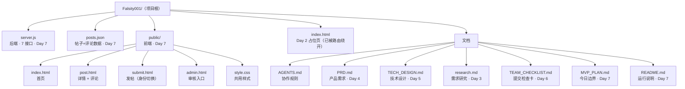

# 项目 · MVP（Day 7）

社会认知 / 职场经验分享网站。本仓库当前是 MVP 第一版 —— 只做能演示核心规则的最小集合。

> 项目名暂未定型，Day 8+ 再正式取名。

## 一键启动

需要本机装了 Node.js（推荐 18+）。

```bash
node server.js
```

启动后会看到：

```
[day7-mvp] listening on http://localhost:8080
```

浏览器打开 [http://localhost:8080/](http://localhost:8080/) 即可。

按 `Ctrl + C` 停止服务。

## 试不同身份（演示用）

身份由 URL 参数切换，**没有登录、没有会话**，纯粹为了演示不同身份走不同路径：

| 身份 | 链接 | 能做什么 |
|---|---|---|
| 未认证（默认） | [`/submit?as=anonymous`](http://localhost:8080/submit?as=anonymous) | 只能发「提问」帖，发布后进审核 |
| 已认证 | [`/submit?as=verified`](http://localhost:8080/submit?as=verified) | 可发「观点」或「提问」，发布后直接上首页 |

其他页面：

| 路径 | 用途 |
|---|---|
| `/` | 首页：列已通过审核的帖子 |
| `/post/:id` | 帖子详情 + 评论列表 + 提交评论 |
| `/submit?as=...` | 发帖页（带身份切换） |
| `/admin` | 审核入口：待审核列表，通过 / 拒绝 |

## 文件结构



> 隐藏目录 `.git/`（git 内部）、`.workbuddy/`（开发助手数据）、`.env`（凭据，已排除）不在图里。

## 数据存储

- 帖子 + 评论统一在 `posts.json`
- 没有数据库（按 PRD 砍功能，Day 23 才引入）
- 启动时会读这个文件，写操作会覆盖写入
- 想恢复种子数据：在 git 里 `git checkout posts.json`（前提是已经 commit 进 git）

## 规则说明（这版 MVP 的规则）

所有判定都在 `server.js` 里，**前端只负责展示**。PRD 的核心规则：

- 已认证用户：可发「观点」或「提问」，直接上首页
- 未认证用户：只能发「提问」，发布后进入待审核，不在首页展示
- 评论：谁都能发，立即显示
- 审核：通过 → 上首页；拒绝 → 从文件删除

## 这版 MVP 不做的事

- ❌ 注册 / 登录 / 密码 / 会话（演示用 URL 参数切身份）
- ❌ 真实公司认证流程（演示用 `?as=verified` 模拟）
- ❌ AI 自动审核（管理员人工审核）
- ❌ 手机端样式（只测桌面浏览器）
- ❌ 数据库（Day 23 才引入，目前用 `posts.json`）
- ❌ 点赞 / 私信 / 关注 / 缓存 / 支付
- ❌ 项目正式命名（Day 8+ 再定）

## 下一步

- Day 8+：项目正式命名、引入 Express（替换内置 http 模块）、拆前端资源、引入 npm 包管理
- Day 23：替换 `posts.json` 为真实数据库

详细计划见 [`MVP_PLAN.md`](./MVP_PLAN.md)。