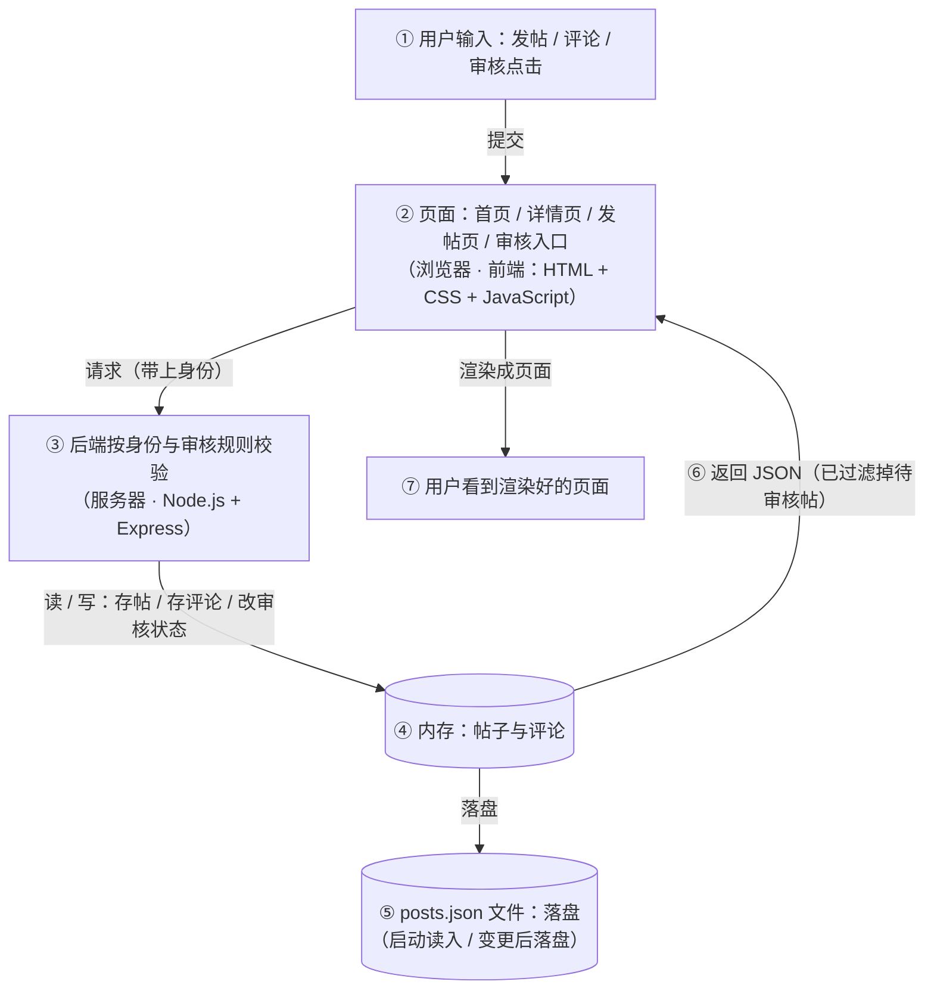

# TECH_DESIGN.md — 技术设计

> Day 5 产出。上游输入：PRD.md（Day 4）。
> PRD 回答「做成什么样」，本文档回答「怎么实现」——数据从哪来、到哪去，每一层各用什么技术来填。
> 项目（暂定名）：社会认知 / 职场经验分享网站——MVP 版

---

## 一、技术路线

**一句话技术路线**：前端用原生 HTML / CSS / JavaScript 渲染页面，后端用 Node.js + Express 提供数据接口并执行规则判断，数据先存放在服务器内存与本地 JSON 文件中，暂不引入数据库。

### 1.1 三层各自用什么、负责什么

| 层 | 用什么 | 在本项目里负责什么 | 为什么选它 |
|---|---|---|---|
| 前端 | HTML + CSS + 原生 JavaScript | 渲染首页、帖子详情页、发帖页、审核入口；把用户的操作发给后端；把后端返回的数据画到页面上 | 页面只有 4 个、交互简单，不引入框架可省掉一整套新语法和构建工具 |
| 后端 | Node.js + Express | 接收前端请求；判断「你是认证用户还是未认证用户」；执行发帖规则与审核规则；组织数据返回给前端 | 核心规则必须跑在服务器上；本机已有 Node；Express 用很少的代码就能起接口 |
| 数据存放 | 服务器进程内存 + `posts.json` 文件 | 存放帖子与评论数据 | 遵守 PRD 范围界定第 5 条：本期不引入数据库 |

### 1.2 选择理由（为什么是这条路线）

1. **规则必须放在后端。** PRD 的核心规则是「认证用户才能发观点帖，未认证用户的提问帖需审核」。这条规则如果写在前端，任何打开网页的人都能看到它、也能绕过它，规则等于不存在。选这条路线，就是为了让规则落在用户改不到的地方。
2. **为 Day 23 铺路。** 「数据存放」这一层现在是「内存 + JSON 文件」，将来换成数据库时，**只改这一层**，前端页面与后端接口协议都不用动。
3. **成本可控。** 不引入数据库（省掉配置与一整套调试面），不引入前端框架与构建工具（省掉学习成本）。本机已有 Node，额外要学的只有「怎么把服务跑起来」这一个动作。

---

## 二、数据流

**一句话数据流**：数据来自用户在页面上的输入与 `posts.json` 里的种子数据，经后端按身份与审核规则校验后写入服务器内存、并落盘回 `posts.json`，再按审核状态过滤后返回前端，渲染成用户看到的页面。

### 2.1 数据流图

读法：从「用户」出发，沿 ①→⑦ 走一圈，数据就完成了一次「从产生到展示」的旅程。

### 2.2 四条链路（数据具体怎么走）

| # | 链路 | 数据从哪来 → 到哪去 |
|---|---|---|
| 1 | **浏览**（读） | 用户打开首页 → 前端向后端要帖子列表 → 后端从**内存**取数据、**过滤掉待审核的提问帖** → 返回 JSON → 前端渲染成列表 |
| 2 | **发帖**（写） | 用户在发帖页提交 → 前端带上身份请求后端 → 后端**先判断身份**：认证用户直接存（立即可见）；未认证用户只能存成「提问」且状态标记为待审核（首页不展示）→ 写入**内存并落盘** → 返回提示 |
| 3 | **评论**（写） | 用户在详情页提交评论 → 后端把评论挂到对应帖子下 → 写入**内存并落盘** → 返回 → 前端立即显示 |
| 4 | **审核**（改状态） | 管理员打开审核入口 → 后端返回待审核列表 → 管理员点「通过」→ 后端**改状态并落盘** → 该帖此后出现在首页；拒绝则不再展示 |

### 2.3 数据存在哪

- **服务器内存**：运行期间的主数据，页面每次读取都从这里取，最快；服务一重启就会清空。
- **`posts.json` 文件**：唯一落盘的地方。服务启动时把它读进内存；每次新增帖子/评论、每次审核改状态后写回它。所以**重启服务数据不丢**。
- **浏览器**：不存业务数据，只负责显示（这正是「规则不能写在前端」的原因）。

---

## 三、依据与边界

### 3.1 未采用的方案与理由

| 未采用的方案 | 为什么不用 |
|---|---|
| 纯前端静态页（无后端，数据写死在浏览器里） | 没有后端，核心规则只能写在前端，可被任何人绕过；数据只活在当前浏览器里；且 Day 23 加数据库时需要重搭一层 |
| 前端 + 后端 + 数据库（如 SQLite）一步到位 | 与 PRD 范围界定第 5 条（本期不做数据库）和验收标准 AC10（MVP 交付物中不出现数据库配置）直接冲突；且属于提前做 Day 23 的内容 |

### 3.2 本期技术边界（明确不引入）

- 不引入数据库（Day 23 起才引入 .env 与数据库配置）
- 不引入前端框架（Vue / React）与构建工具，用原生 HTML / CSS / JavaScript
- 不做用户注册登录、不做真实公司认证（认证与未认证身份用写死数据模拟）
- 不做移动端适配（按桌面浏览器设计）
- 本文件不含代码：Day 7 起按本路线实现页面与接口

### 3.3 后续演进方向（不属于本期）

- **数据层**：`posts.json` 文件 → 数据库（Day 23 起），只替换数据层实现，前后端结构不动
- **前端**：若页面数量明显增长，再评估是否引入前端框架
- **部署方式**：待定，本期只保证本机能跑起来

### 3.4 方案变化影响面（改动会波及哪些文件）

> 下表中的代码文件（`server.js`、各页面、`public/` 等）是 Day 7 起按本路线实现时的**预计文件名**，实现时如有出入以实际为准。这张表的用途：**动手改方案之前，先看清这一刀会切到哪里。**

| 方案变化 | 会受影响的文件 | 基本不受影响的 | 说明 |
|---|---|---|---|
| `posts.json` 换成数据库（Day 23 计划内） | `server.js` 的数据读写部分、删掉 `posts.json`、新增 `.env` | 全部前端页面、接口地址与返回格式、数据流图的整体结构（只是「内存 / 落盘」那一格换成数据库） | 动得最少的一次变化——这正是当初选路线 B 的核心理由 |
| 引入前端框架（如 Vue / React） | 全部前端页面与脚本，等于重写前端 | `server.js`、`posts.json`、接口协议 | 动得最大的一次变化，所以 3.3 才写「页面数量明显增长再评估」 |
| 增加注册登录（后续迭代） | `server.js`（新增接口与会话管理）、数据层要加用户数据、每个页面（导航栏）、**`PRD.md`（范围界定第 1 条需解除）** | 审核规则本身、帖子数据结构 | 产品文档和技术文件要一起动，成本最高的一类变化 |
| 移动端适配 | `public/style.css` 为主 | `server.js`、`posts.json`、页面结构 | 样式独立成文件的好处：一次变化被关在一个文件里 |
| 审核从人工点击改为 AI 自动 | `server.js` 的审核模块、`admin.html`（审核入口） | 其他页面、帖子数据结构 | 只动「审核」这条链路的两端 |

**读法**：越靠上的变化动的文件越少，说明当前设计把「将来最可能变的部分」（数据层）隔离得最好。以后每次想改方案，先回来查这张表，就知道该小心哪些文件。

### 3.5 待定项

- 项目名称未定，沿用 PRD 中的暂定名，定名后统一替换。
